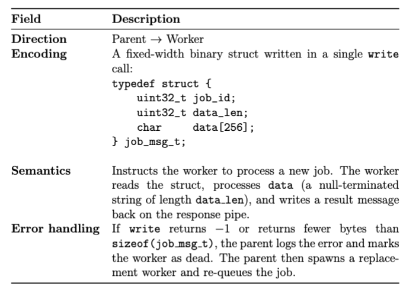

# Success Criteria
## Overall
- [ ] parent controller orchestrates the work 
- [ ] at least three worker processes running **concurrently**
- [ ] inter-process communication must travel **over pipes**, not memory / signals / temporary files as the **primary** communication channel. 
- [ ] no external libraries 
- [ ] written in C

## Systems Programming 
- uses either pipes / sockets to pass meaningful data 
- can identify and explain each message type passed between pipes 
- achieves concurrency and is important to design 
- handle error from all system calls (`read`, `write`, `fork`, `accept`, `connect`)
- no resource leaks 

## Documentation 
- every message type is fully documented like below 

- architecture diagram is complete and accurate 
- report is self-contained 
- report is independent from video (complementary, not repetitive)

## Video 
- ~3 minutes, <5 minutes
- demonstrates specific feature that uses pipes or sockets 
- shows relevant source code and explains how it works internally 
- link works 

# Deliverables 
- .c / .h files 
- Makefile (builds whole project with `make`)
- project.pdf 
- video.txt (YouTube URL of demo video)

# Resources 
https://youtu.be/S1tN9a4Proc?si=xcPpco1-wWQvCzGj&t=650 (TensorFlow Ring AllReduce explanation)

https://github.com/NVIDIA/nccl/blob/361915904b456d397e6e1578f8f65ea1a45bdd28/src/device/all_reduce.h#L12-L84 (Implementation in NVIDIA/nccl)
